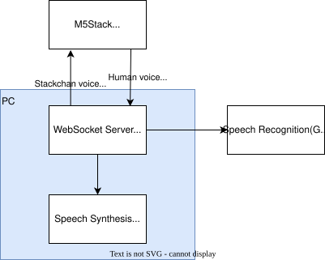

# StackChan WebSocket Control Server

WebSocketでStackChanを制御するためのサーバーアプリケーションと、そのファームウェアです。

StackChanをフロントにし、メインのロジック処理をPC上のPythonで実現することで、Pythonライブラリを使った外部サービスとの連携などが実装しやすくなることを狙っています。



> [!CAUTION]
> This is work in progress. The API and functionality may change without notice.

> [!CAUTION]
> これはｽﾀｯｸﾁｬﾝを楽しむための個人のコミュニティプロジェクトです。M5Stack社や、その他のｽﾀｯｸﾁｬﾝ関連プロダクトとは関係ありません。

## サンプルコード

サンプルアプリケーション [example_apps/](./example_apps/)

以下の関数で、wake word を起点に対話セッションを実装できます。

```py
@app.talk_session
async def talk_session(proxy: WsProxy):
    text = await proxy.listen()
    await proxy.speak(text)
```

### Geminiの応答

```
uv sync --group example-gemini
```

[example_apps/gemini.py](./example_apps/gemini.py)

```py
app = StackChanApp()

client = genai.Client(vertexai=True).aio

@app.setup
async def setup(proxy: WsProxy):
    logger.info("WebSocket connected")

@app.talk_session
async def talk_session(proxy: WsProxy):
    chat = client.chats.create(
        model="gemini-3-flash-preview",
        config=types.GenerateContentConfig(
            system_instruction="あなたは親切な音声アシスタントです。音声で返答するため、マークダウンは記述せず、簡潔に答えてください。だいたい3文程度で答えてください。",
        ),
    )

    while True:
        # 聞くポーズ
        await proxy.move_servo([(ServoMoveType.MOVE_Y, 80, 100)])

        try:
            # 音声認識
            text = await proxy.listen()
        except EmptyTranscriptError:
            # 音声なし
            await proxy.move_servo([(ServoMoveType.MOVE_Y, 90, 100)])
            return

        logger.info("Human: %s", text)

        # 頷く
        await proxy.move_servo(
            [
                (ServoMoveType.MOVE_Y, 100, 100),
                (ServoWaitType.SLEEP, 200),
                (ServoMoveType.MOVE_Y, 90, 100),
                (ServoWaitType.SLEEP, 200),
                (ServoMoveType.MOVE_Y, 100, 100),
                (ServoWaitType.SLEEP, 200),
                (ServoMoveType.MOVE_Y, 90, 100),
            ]
        )

        # AI応答の取得
        resp = await chat.send_message(text)

        # 話す
        logger.info("AI: %s", resp.text)
        if resp.text:
            await proxy.speak(resp.text)
```

## セットアップ

以下を確認ください。

[docs/setup_ja.md](docs/setup_ja.md)


## 現在開発中の環境

- 本体: M5Stack CoreS3 SE
- 音声認識: Google Cloud Speech-to-Text, Whisper.cpp
- 音声合成: Google Cloud Text-to-Speech, VOICEVOX

## コードの構成

- ファームウェア [firmware/](./firmware/)
- Pythonサーバのライブラリ [stackchan_server/](./stackchan_server/)
- サンプルアプリケーション [example_apps/](./example_apps/)
