# Google Cloudの契約と設定方法

このプロダクトでは、Google Cloudの以下のサービスを利用します。

- 推論: Google Cloud Vertex AI
- 音声認識: Google Cloud Speech-to-Text

> [!CAUTION]
> Google Cloudの利用には、一定金額、一定期間無料で利用できる利用枠がありますが、その後は従量制料金で課金されます。利用状況に応じて高額請求されるリスクがあります。

## 手順

1. Googleアカウントを作成する
1. Google Cloudのプロジェクトを作成する
2. 利用するサービスを有効化する
3. Vertex AIにて、利用するモデルを有効化する
4. サービスアカウントを作成する
5. サービスアカウントに、必要なロールを付与する
6. サービスアカウントの秘密鍵を作成し、ダウンロードする

## Googleアカウントを作成する

Googleアカウントを保持していない場合は、以下のページから「アカウントを作成する」をクリックし、Googleアカウントを作成して下しさい。

> Googleアカウント
>
> https://www.google.com/intl/ja/account/about/

## Google Cloudのプロジェクトを作成する

既に利用できるGoogle Cloudのプロジェクトをお持ちの場合は、そちらを利用しても構いません。

### Google Cloudのプロジェクトを初めて作成する場合

以下のページより、「無料で開始」を押し、無料トライアルに進んでください。

> Google Cloud
>
> https://cloud.google.com/free?&hl=ja

住所等の登録が必要です。
登録後、「プロジェクトの作成」に進みます。

### 既にGoogle Cloudのプロジェクトがあり、新たにプロジェクトを作成する必要がある場合

コンソールにアクセスします。

> https://console.cloud.google.com/welcome

画面左上のプロジェクト名をクリックし、プロジェクト選択のダイアログを開きます。

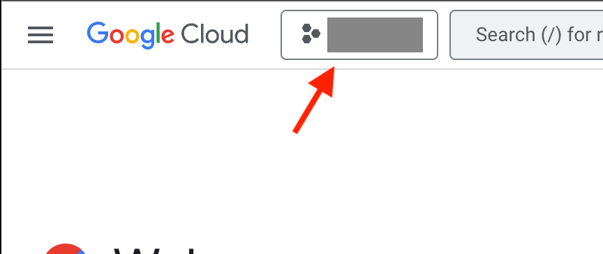

「プロジェクトを作成」をクリックし、プロジェクトの作成画面に進みます。

### プロジェクトの作成

Project Nameに「stackchan-dev-74th」など適当なプロジェクト名を入力し、「作成」をクリックします。

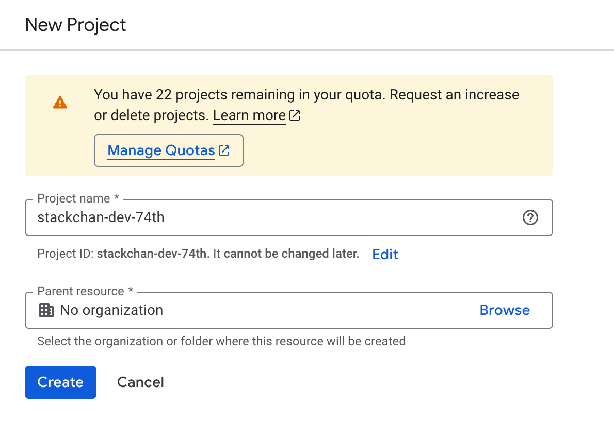

作成後、プロジェクトを選択します。

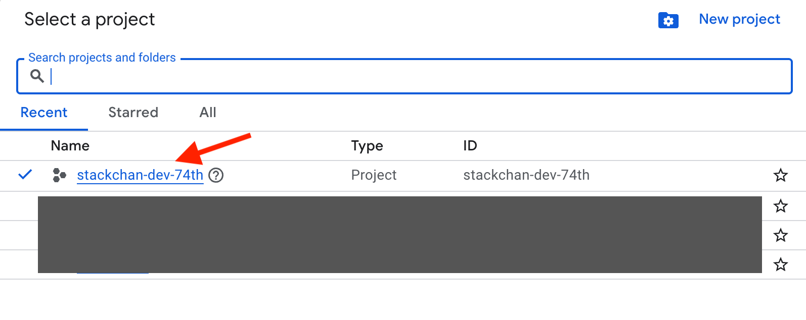

## 利用するサービスを有効化する

検索バーをクリックして、検索欄を表示します。

ここに、以下で「Cloud Speech-to-Text API」と検索し、出てきたサービスをクリックして、サービスのページに遷移します。
この時、ドキュメントページとAPIページが検索結果に出てきますが、APIのアイコンを確認して、APIページを選択してください。

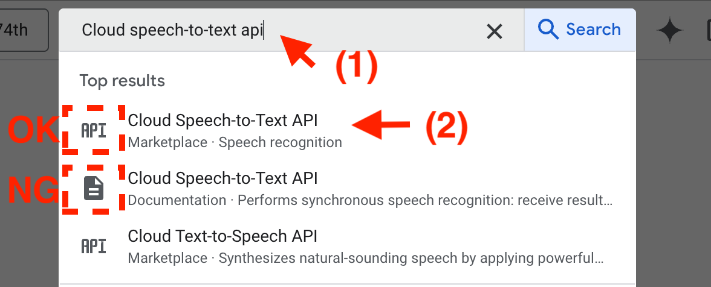

「有効にする」をクリックして、APIを有効化します。

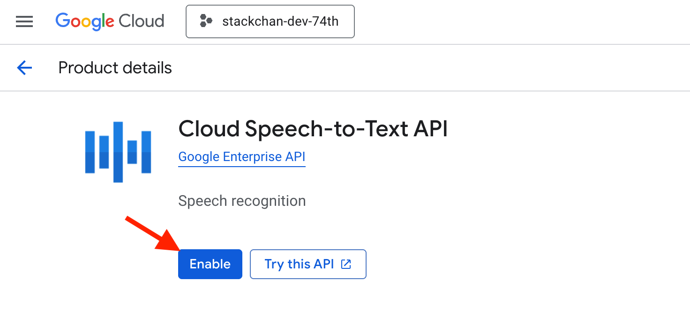

合わせて、以下のAPIを有効化してください。

- (上記で実施済み) Google Cloud Speech-to-Text API
- Vertex AI API

## Vertex AIにて、利用するモデルを有効化する

Vertex AIでは、Google提供のモデルは初期状態で利用可能になっていますが、Claudeなどのパートナーモデルは利用する前に有効化が必要です。
ここでは、Anthoropic の Claude Haiku 4.5 を有効化する方法を説明します。

モデルの有効化は、モデルのカタログページである Model Garden から行います。

検索欄にて、Model Gardenと検索し、Model Gardenのページに遷移します。

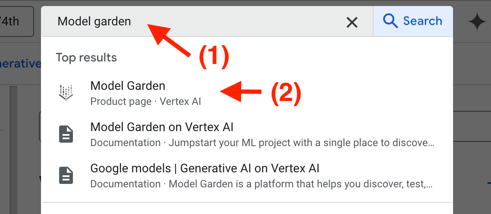

Search Modelsの欄に、利用するモデル名を入力します。
「Claude Haiku 4.5」と入力して検索し、出てきたモデルをクリックします。

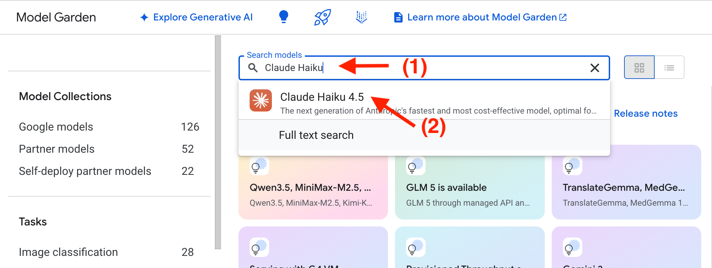

「有効にする」をクリックしてモデルを有効化します。

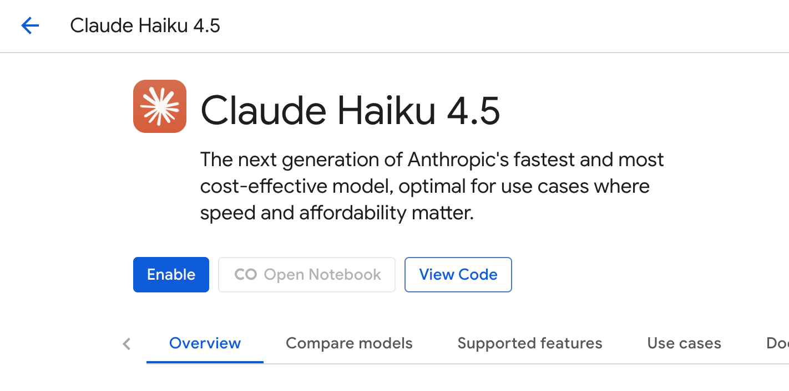

利用先についての照会が表示されるので、入力します。
個人の利用であれば以下のように入力してください。

- Bussiness Name（会社名）: 氏名 (Personal)
- Bussiness website（会社のウェブサイト）: 個人が証明できるURL（例: TwitterのプロフィールURLなど）
- Contact email address（連絡先アドレス）: 連絡可能なメールアドレス
- Where is your Business headquarted（本社所在国） : Japan
- Who are your intended users of Claude models（Claudeモデルの想定ユーザー）: Internal employees
- What are your intended use cases for Claude models（Claudeモデルの想定ユースケース）: self-built home voice assistant application for personal use
    - (日本語訳) 個人開発、個人利用のホーム音声アシスタントアプリケーション
- Do any of your use cases have additional requirements per Anthropic's Acceptable Use Policy?: Yes
    - 高リスク事例、追加ユースケースにあたいするかの質問。高リスク事例は「法務」「ヘルスケア」「保険」「金融」等で、追加ユースケースとは「消費者向けチャットボット」、「未成年向け製品」「エージェントによる利用」「ClaudeのMCPサーバの利用」をさします。「エージェントによる利用」であるため、Yesを選択します。
- If yes, please describe how you plan to meet the additional requirements.（追加要件はどのように守るか）: Used only in a personal home environment by the developer.
    - (回答日本語訳) 開発者の個人の家庭環境でのみ使用します。

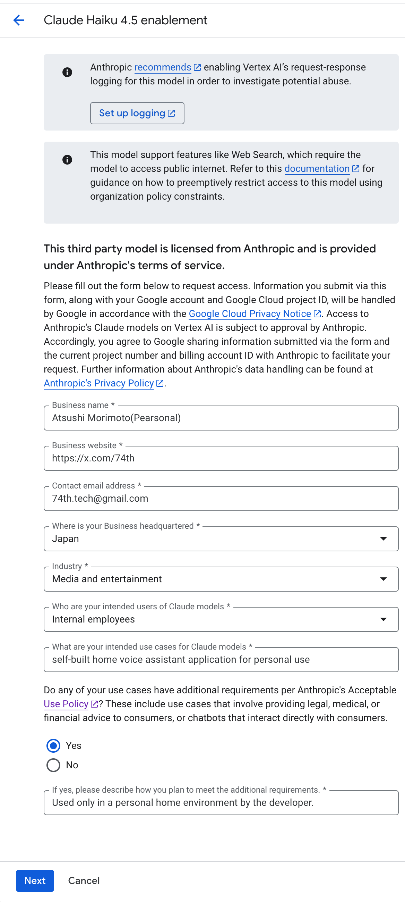

次に承諾確認ページが表示されるため、内容を確認の上、Terms and agreementsにチェックを入れて、「同意（Agree）」をクリックします。

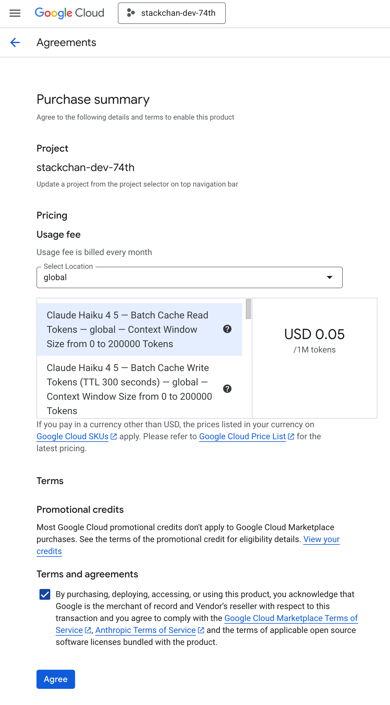

成功の表示が出ればモデルの有効化は完了です。

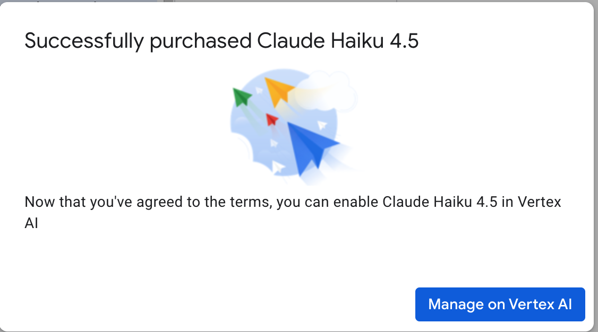

## サービスアカウントを作成、必要なロールを付与する

Google Cloudでは、特定のGoogle Cloudのサービスを利用する権限を持ったサービスアカウントを作成して、そのサービスアカウントの認証情報を使ってAPIを呼び出すのが一般的です。
ここでは、サービスアカウントの作成方法を説明します。

検索欄にService Accountsと入力し、サービスアカウントのページに遷移します。

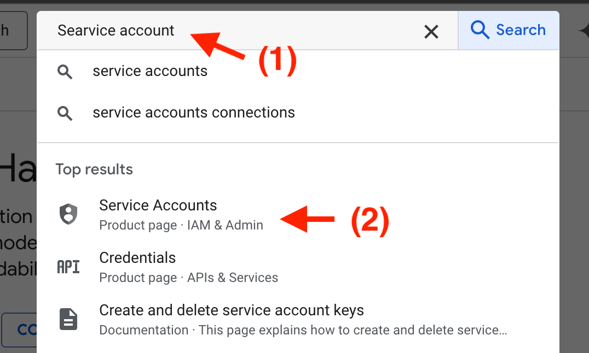

Create Service Accountをクリックして、サービスアカウントの作成を開始します。

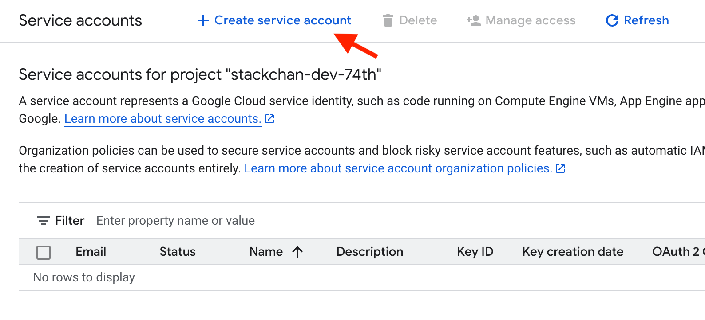

サービスアカウントの名前を入力し、Create and Continueをクリックします。

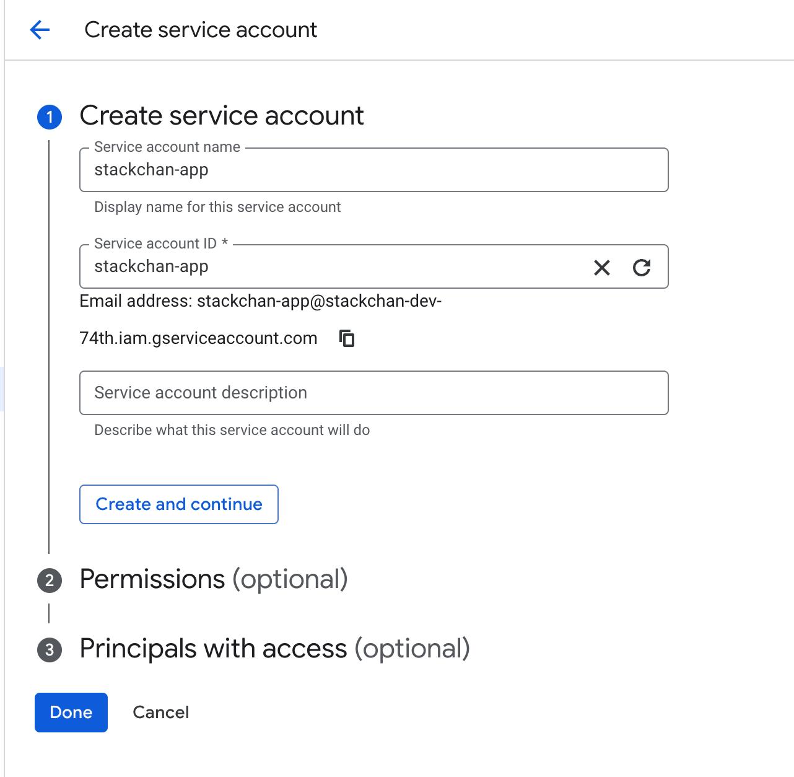

Select a role から以下のロールを選択して追加します。

- Cloud Speech Client（日本語名: Cloud Speech クライアント）
- Vertex AI User（日本語名: Vertex AI ユー
ザー）

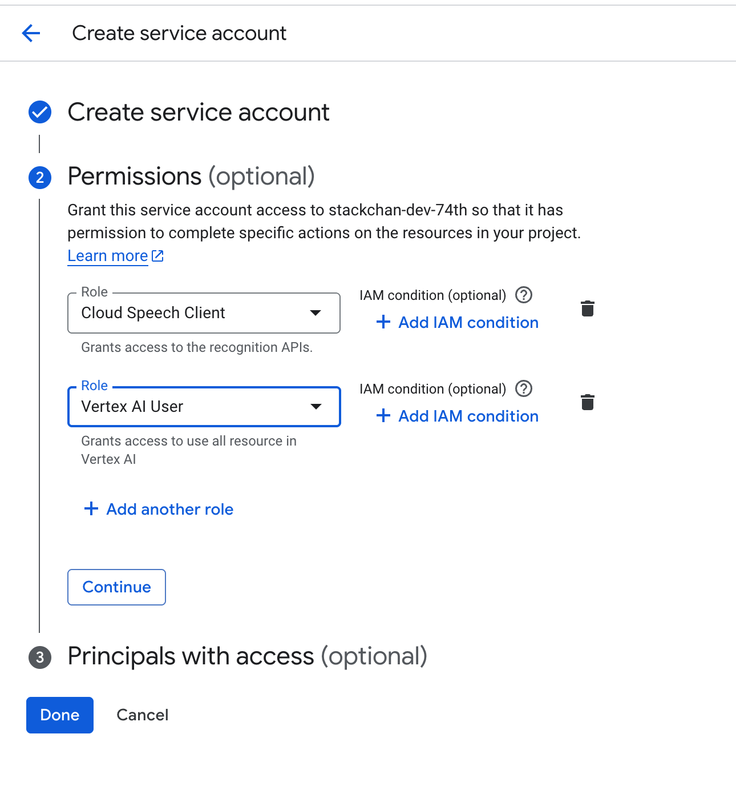

設定後、Done（完了）をクリックします。

なお、後からロールを追加することも可能です。
サービスアカウントページのサービスアカウントのEmailをクリックします。

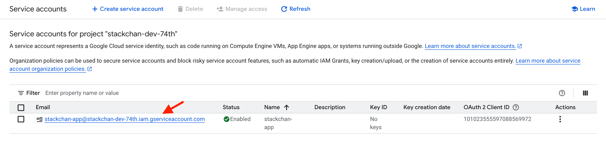

タブのPermissionsを開き、Manage accessをクリックします。

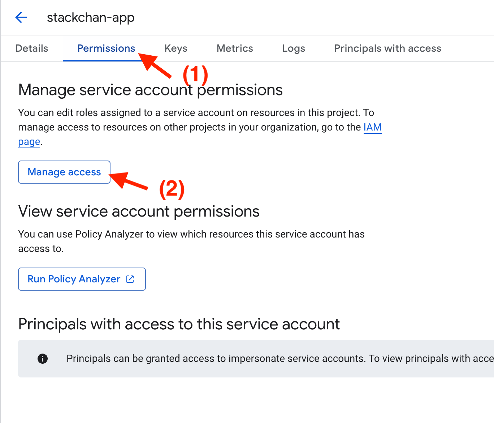

表示されるAssign rolesに「Add another role」で必要なロールを追加して、Saveをクリックします。

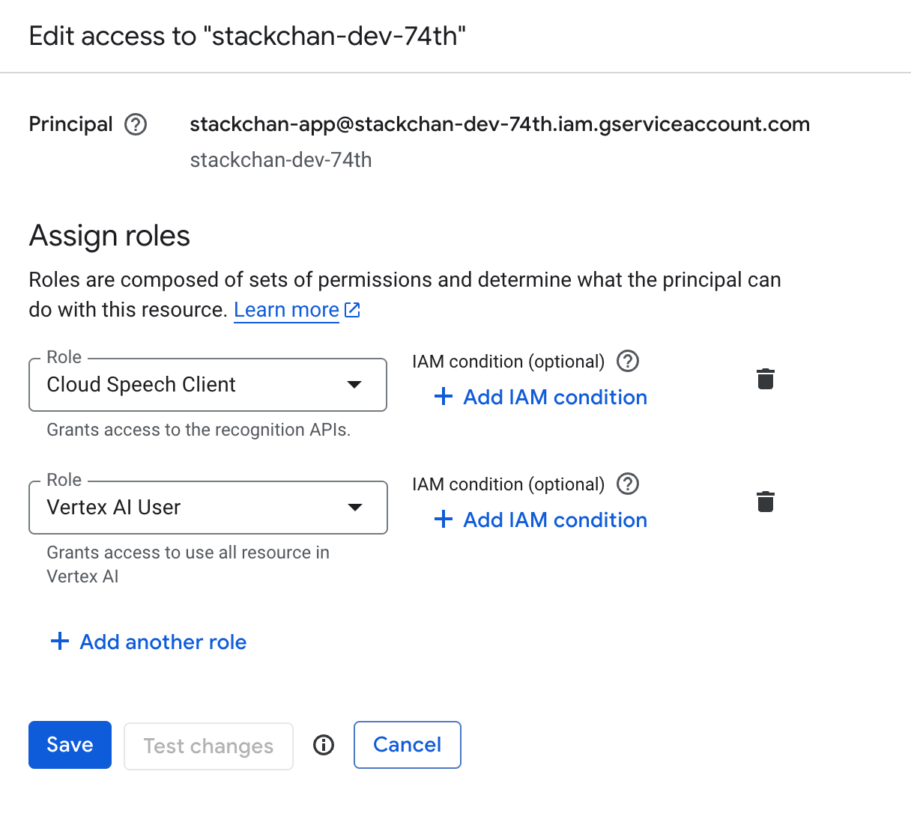

## サービスアカウントの秘密鍵を作成し、ダウンロードする

サービスアカウントのページにて、作成したサービスアカウントのEmailをクリックします。

タブのKeysを開き、Add Key > Create new keyをクリックします。

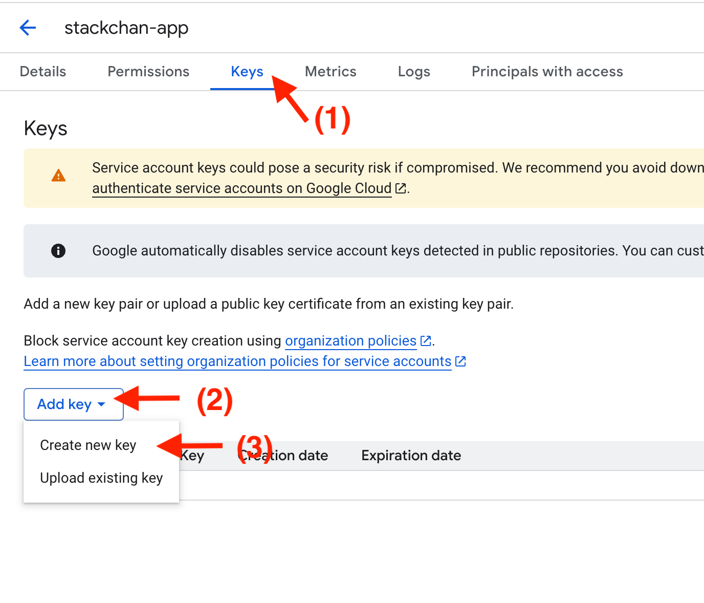

キーの種類の選択が表示されますが、JSONを選択して、Createをクリックします。

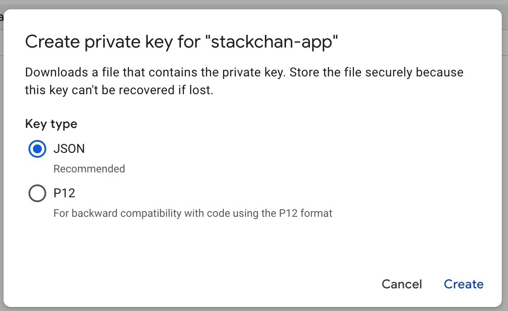

すると、秘密鍵が作成され、JSONファイルがダウンロードされます。
このJSONファイルを安全に保管しておいてください。
