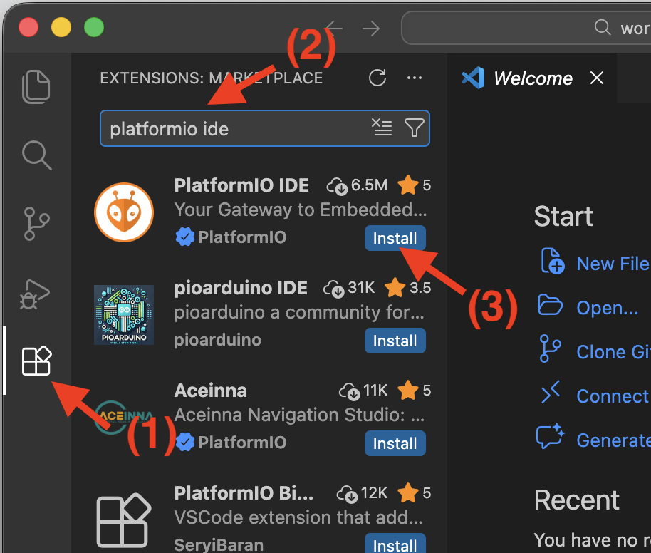
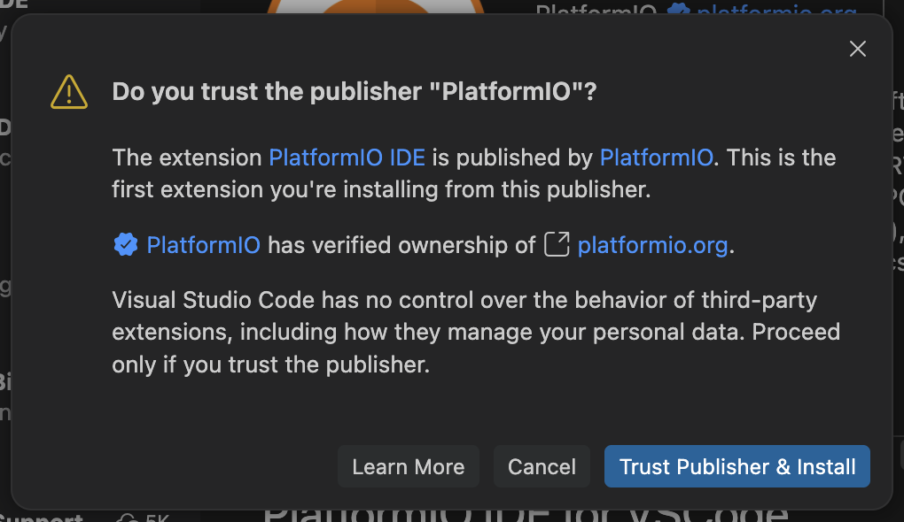
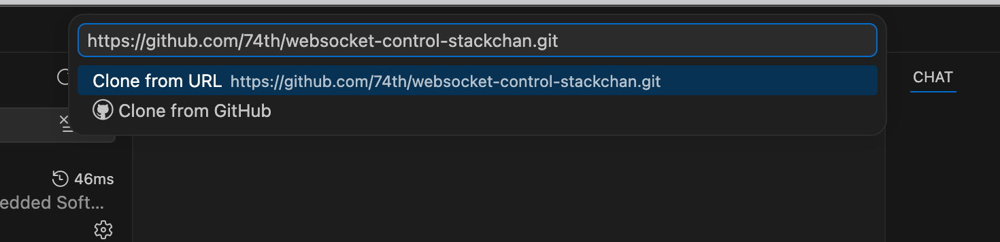
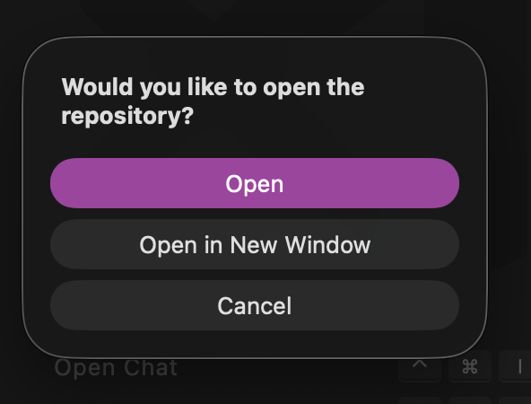
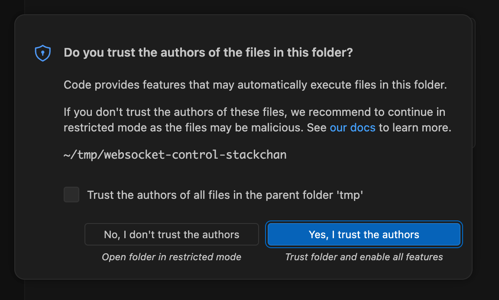
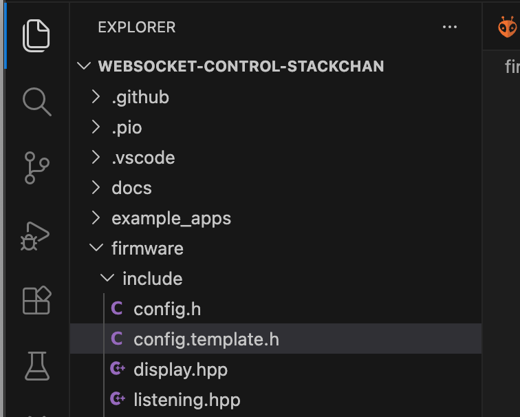
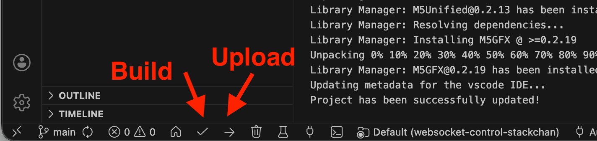

# PlatformIOのインストールと環境構築方法

PlatformIOは、VS Codeの拡張機能として提供されています。

1. VS Codeのインストール
2. VS Codeの拡張機能から、PlatformIO IDEをインストールする

## VS Codeのインストール

VS Codeは、以下のURLからダウンロードできます。

https://code.visualstudio.com/Download

ダウンロード後、PCにインストールしてください。

各OS毎のセットアップの方法については、以下の公式ドキュメントを参照ください。
英語のため、日本語日本訳して利用してください。

> https://code.visualstudio.com/docs/setup/setup-overview

## PlatformIO IDEのインストール

VS Codeを起動し、左側のアクティビティーバーから拡張機能を選択し、検索欄に「platformio ide」と入力します。
「PlatformIO IDE」が表示されたら、「インストール」をクリックしてインストールしてください。



Trust Publisherのダイアログが表示されるため、発行者を信用してインストールを押してください。



## PlatformIOで起動することの確認

本リポジトリをクローンします。
Gitコマンドが使える場合、以下のコマンドでクローンします。

```
git clone https://github.com/74th/websocket-control-stackchan.git
```

VS Code上で行う場合、F1キーを押してコマンドパレットを開き、「Git: クローン（Git: Clone）」を実行します。
入力欄にて、以下のURLを入力します。

```
https://github.com/74th/websocket-control-stackchan.git
```



保存先を選択すると、そこにリポジトリがクローンされます。
その後、どうやってこのディレクトリを開くかの選択肢が表示されるため、「開く（Open）」を選択してください。



初めて開いたときには、ワークスペースを信用するかどうかのダイアログが開かれます。
「はい、作成者を信頼します（Yes, I trust the authors）」を選択してください。



初めてPlatformIO IDEがある状態でワークスペースを開くと、ファームウェア開発で使うライブラリやパッケージのインストールが始まります。

ファームウェアは、WiFi等の初期設定が必要です。
左側サイドバーエクスプローラーを開き、ファイルツリーから、firmware/include/config.template.h を選択し、Win/Linux Ctrl+C、Ctrl+V、Mac Command+C、Command+Vでコピーします。
コピーされたファイルを、右クリックして名前を変更し、config.hという名前にしてください。



これで、設定はまだですが、PlatformIO IDEでファームウェアのビルドができる状態になりました。

ステータスバーからBuildアイコンを押し、ビルドが成功することを確認してください。


